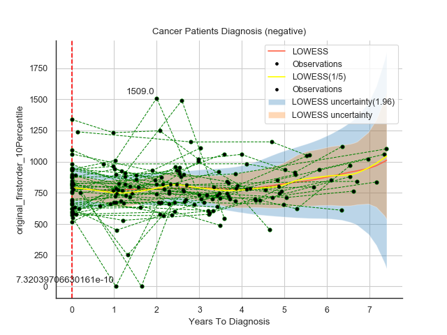
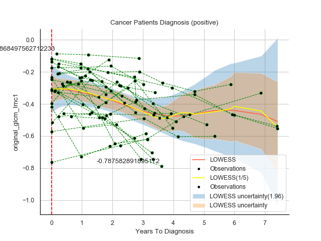

[](https://github.com/kbronik2017/Machine_Learning_Cancer_Research_UCL/issues)
[](https://github.com/kbronik2017/Machine_Learning_Cancer_Research_UCL/network)
[](https://github.com/kbronik2017/Machine_Learning_Cancer_Research_UCL/stargazers)
[](https://github.com/kbronik2017/Machine_Learning_Cancer_Research_UCL/blob/master/LICENSE)

# Machine learning and Artificial Intelligence for time series analysis


# Table of contents
1. [Introduction](#introduction)
2. [RNN](#paragraph1)
    1. [Bidirectional LSTM-RNN](#subparagraph1)
3. [Plot_ElasticNet](#paragraph2)
4. [Plot_Lasso](#paragraph3)
5. [Plot_LogisticRegression](#paragraph4)
6. [Plot_RandomForestClassifier](#paragraph5)
7. [Plot_Lowess](#paragraph6)
 1. [ADC](#subparagraph6)
 2. [T2W](#subparagraph6)
8. [Running the Python codes!](#paragraph7)

## Introduction <a name="introduction"></a>

Machine learning algorithms to analyze serial multi-dimensional data to predict prostate cancer progression

## RNN <a name="paragraph1"></a>

### Bidirectional LSTM-RNN <a name="subparagraph1"></a>
<br>
 
</br>

## Plot_ElasticNet <a name="paragraph2"></a>

https://scikit-learn.org/stable/modules/generated/sklearn.linear_model.ElasticNet.html

Linear regression with combined L1 and L2 priors as regularizer.

Minimizes the objective function:

1 / (2 * n_samples) * ||y - Xw||^2_2
+ alpha * l1_ratio * ||w||_1
+ 0.5 * alpha * (1 - l1_ratio) * ||w||^2_2
If you are interested in controlling the L1 and L2 penalty separately, keep in mind that this is equivalent to:

a * ||w||_1 + 0.5 * b * ||w||_2^2
where:

alpha = a + b and l1_ratio = a / (a + b)
The parameter l1_ratio corresponds to alpha in the glmnet R package while alpha corresponds to the lambda parameter in glmnet. Specifically, l1_ratio = 1 is the lasso penalty. Currently, l1_ratio <= 0.01 is not reliable, unless you supply your own sequence of alpha.


## Plot_Lasso <a name="paragraph3"></a>

https://scikit-learn.org/stable/modules/generated/sklearn.linear_model.Lasso.html

Linear Model trained with L1 prior as regularizer (aka the Lasso).

The optimization objective for Lasso is:

(1 / (2 * n_samples)) * ||y - Xw||^2_2 + alpha * ||w||_1
Technically the Lasso model is optimizing the same objective function as the Elastic Net with l1_ratio=1.0 (no L2 penalty).

## Plot_LogisticRegression <a name="paragraph4"></a>

https://scikit-learn.org/stable/modules/generated/sklearn.linear_model.LogisticRegression.html

Logistic Regression (aka logit, MaxEnt) classifier.

In the multiclass case, the training algorithm uses the one-vs-rest (OvR) scheme if the ‘multi_class’ option is set to ‘ovr’, and uses the cross-entropy loss if the ‘multi_class’ option is set to ‘multinomial’. (Currently the ‘multinomial’ option is supported only by the ‘lbfgs’, ‘sag’, ‘saga’ and ‘newton-cg’ solvers.)

## Plot_RandomForestClassifier <a name="paragraph5"></a>

https://scikit-learn.org/stable/modules/generated/sklearn.ensemble.RandomForestClassifier.html

A random forest is a meta estimator that fits a number of decision tree classifiers on various sub-samples of the dataset and uses averaging to improve the predictive accuracy and control over-fitting. The sub-sample size is controlled with the max_samples parameter if bootstrap=True (default), otherwise the whole dataset is used to build each tree.

## Plot_Lowess <a name="paragraph6"></a>
locally weighted scatterplot smoothing
<br>
  
</br>

## Running the Python codes!<a name="paragraph7"></a> 

First, user needs to install Anaconda https://www.anaconda.com/

Then


```sh
  - conda env create -f train_test_environment.yml
  or
  - conda create --name idp --file clone-file.txt
``` 
and 

```sh
  - conda activate idp
``` 
finally

```sh
  - python  (any of the above python code).py
``` 

