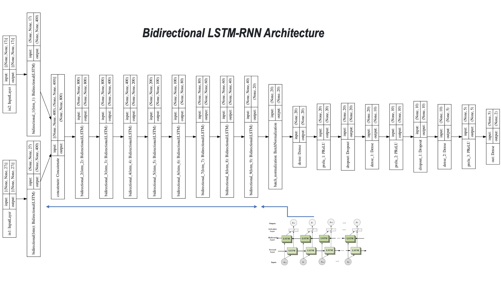

# Machine learning algorithms to analyze serial multi-dimensional data to predict prostate cancer progression


<br>
 
</br>


# Running the Python codes! 

First, user needs to install Anaconda https://www.anaconda.com/

Then


```sh
  - conda env create -f train_test_environment.yml
  or
  - conda create --name idp --file clone-file.txt
``` 
and 

```sh
  - conda activate idp
``` 
finally

```sh
  - python  VAE_GUI.py
``` 

After lunching the graphical user interface, user will need to provide necessary information to start training/testing as follows:  

<br>
 
</br>
